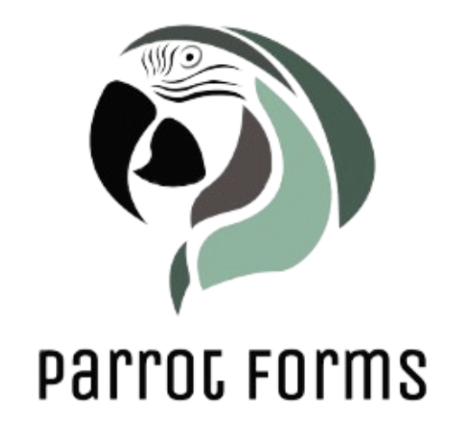

<p align="center">
  
</p>

# Parrot Forms

## Overview
Imagine doctors having conversations with hundreds of different patients, generating a huge amount of unstructured data. Our idea is to use the ChatGPT API to transform this unstructured data into a consistent and readable format like JSON. During our internship, we explored how ChatGPT can take these raw conversations and automatically format them into structured forms called JSON. This means that all the important information discussed between doctors and patients can be organized without the need for manual entry. This not only saves time but also ensures that data is accurate and easy to analyze.

As a part of the <a href="https://cds.coe.hawaii.edu/hokulani/summer-2024-program/">Highscool Summer Internship program</a> of <a href="https://cds.coe.hawaii.edu/hokulani/">the Project Hokulani</a>, we present Parrot Forms - a tool to automate the process of filling patient information forms using the power of AI and large language models. It utilizes Whisper AI to take those live chats between doctors and patients and turn them into easy-to-understand dialogues for the computer to process the information. Our app then takes the generated dialogue and fills out the form.

## Key Components
### 1. Whisper for Speech-to-Text Conversion
The system uses Whisper to convert conversations between doctors and patients into a blob of text. This forms the basis of our automated data extraction process.

### 2. ChatGPT for Data Structuring
ChatGPT processes the text blob, converting it into a structured conversation and then into a JSON object. This imposes structure on the raw text data, making it manageable and easy to manipulate.

### 3. Flask for Server Management
We use Flask to open a server, providing a platform for our automated system to operate and interact with the user.

### 4. Selenium for Form Automation
Selenium is employed to automate the process of filling out the form on the website. This ensures that the data is entered swiftly and accurately, mimicking human input.

<!-- ### 5. Dynamic Dashboard
Our advanced dashboard, powered by ChatGPT, dynamically updates with each patient visit JSON. It showcases metrics, patient details, and organizes upcoming appointments in list and calendar formats. It features a progress circle and allows for easy addition and deletion of appointments, ensuring up-to-date information automatically. -->

## Folder Structure
```
PARROTFORMS/
├── data/
│ ├── audio_data/
│ ├── conversation/
│ │ ├── CAR0001_conv.txt
│ │ ├── CAR0003_conv.txt
│ │ ├── DER0001_conv.txt
│ │ ├── ...
│ ├── demo_json_data/
│ ├── json_data/
│ │ ├── CAR0001.json
│ │ ├── CAR0003.json
│ │ ├── DER0001.json
│ │ ├── ...
│ ├── transcription/
│ │ ├── CAR0001.txt
│ │ ├── CAR0003.txt
│ │ ├── DER0001.txt
│ │ ├── ...
│ ├── constraints.json 
├── saved_data/
│ ├── saved_data_John Doe.json
│ ├── ...
├── static/
│ ├── css/
│ │ ├── style.css
│ ├── images/
│ │ ├── jungle-overlay.png
│ │ ├── jungleBackground.jpg
│ │ ├── parrotForms.png
│ ├── js/
│ │ ├── script.js
├── app.py
├── automate.py
├── demo_medical_hist.html
├── whisper.py
├── readme.md
├── requirements.txt
```

## Installation Instructions
1. **Clone the Repository**
   ```sh
   git clone https://github.com/yourusername/parrotforms.git
   cd parrotforms
   ```
2. **Create a Virtual Environment**
   ```sh
   python3 -m venv venv
   source venv/bin/activate  # On Windows use `venv\Scripts\activate`
   ```

3. **Install Dependencies**
   ```sh
   pip install -r requirements.txt
   ```


## Running Instructions
1. **Start the Flask Server**
   ```sh
   python app.py
   ```
2. **Start the Automatic Form Filling**
   ```sh
   python automate.py
   ```